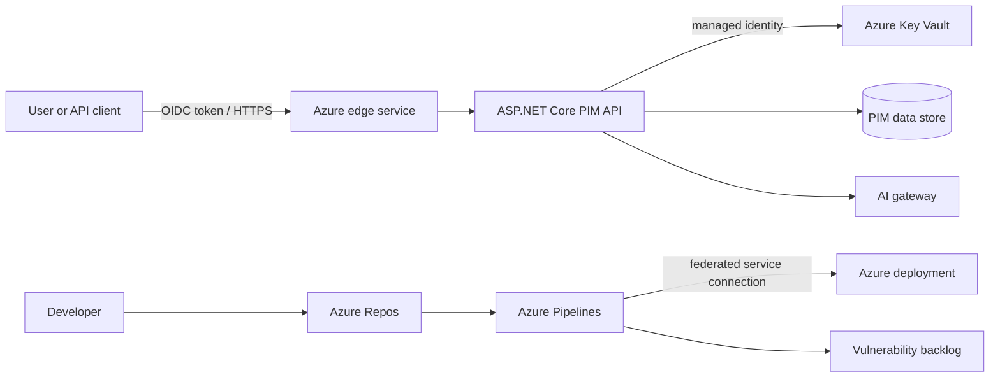

# Minimal Reference Architecture

The local implementation currently includes the health path, JWT-protected in-memory PIM API, token-derived tenant boundary, structured audit event, and validation pipeline. Tests use locally signed tokens; live Auth0, Azure services, and AI integration are not deployed yet.

## Trust Boundaries

1. Internet clients to the Azure edge and API: authenticate, authorize, validate input, rate limit, and log safely.
2. API to tenant data: derive tenant context from validated identity claims and enforce it at every query boundary.
3. Workload to Azure services: use managed identity and least-privilege RBAC; keep secrets in Key Vault.
4. Repository to pipeline: treat code, pull requests, scanner findings, and AI-generated changes as untrusted.
5. API to AI gateway: minimize data, isolate tools, validate outputs, and require human approval for security decisions.

Production use additionally requires availability design, private networking decisions, centralized telemetry, incident response, backups, policy enforcement, and measured capacity.
