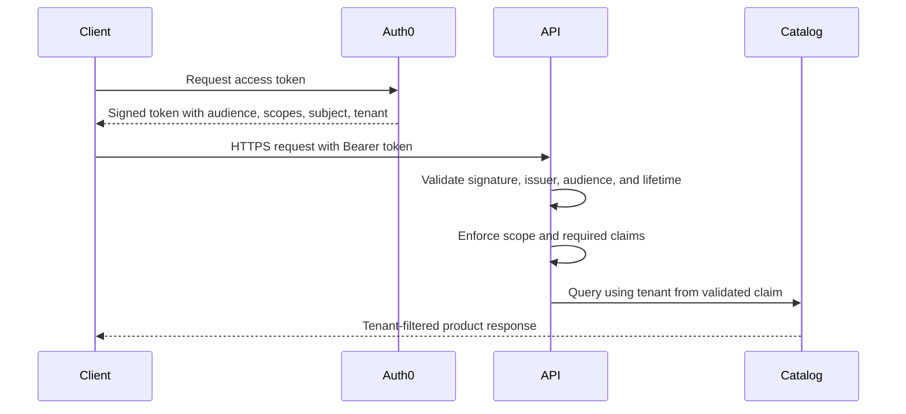

# OAuth/OIDC and Auth0 Integration

## What Was Built

The API now validates OAuth 2.0 bearer access tokens with ASP.NET Core's JWT bearer handler. Product reads require `products:read`; product creation requires `products:write`. Both policies require an authenticated subject and the namespaced tenant claim `https://securepim.example/tenant_id`.

The API reads tenant context from the validated token and passes it into every catalog operation. Clients cannot choose tenant context through request data. Successful product creation writes a structured audit event containing the product ID, authenticated subject ID, and tenant ID. Tokens and product content are excluded from that event.

## Why It Was Built This Way

The access token is evidence that an authorization server authenticated or otherwise authorized a principal for this API. Signature, issuer, audience, and expiry validation prevent the API from trusting altered tokens, tokens issued by another authority, tokens intended for another API, or expired tokens.

Scopes express the operation the caller may perform. Tenant claims determine which tenant's data that operation applies to. Keeping these decisions separate prevents a valid user or client from converting read access into write access or selecting another tenant.

## How a Request Is Authorized

Missing or invalid credentials return `401 Unauthorized`. A valid token that lacks a required scope or tenant claim returns `403 Forbidden`.

## Auth0 Activation

The checked-in authority is a non-secret placeholder. To connect a free Auth0 test tenant:

1. Create an Auth0 API with identifier `https://securepim-api` and RS256 signing.
2. Define the permissions `products:read` and `products:write`.
3. Add the namespaced tenant claim to access tokens using an Auth0 Action.
4. Set `Authentication__Authority` to `https://<tenant-region>.auth0.com/` through local environment configuration.
5. Keep `Authentication__Audience` as `https://securepim-api`, or update both Auth0 and the application to the same identifier.

The API needs public signing metadata, issuer, and audience. It does not require an Auth0 client secret to validate access tokens. Auth0 pricing and current free-tier limits must be reviewed before account setup.

## Local Verification

Integration tests replace Auth0 metadata with a local signing key and create short-lived test tokens. They verify missing credentials, untrusted issuers, wrong audiences, invalid signatures, expired tokens, absent tenant claims, insufficient scope, and cross-tenant filtering through the real JWT bearer handler and authorization policies.
