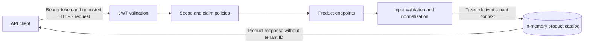

# Product API Threat Model

## Scope and Data Flow

This model covers the local synthetic product API. A client sends a bearer access token and HTTPS request through security middleware. JWT validation and authorization policies verify the token and required scope before endpoint handlers run. Handlers validate input, derive tenant context from the validated claim, and call a singleton in-memory catalog.

The client-to-application boundary is untrusted. The endpoint-to-catalog call is a security boundary because tenant context and validated data must remain application-controlled.

## STRIDE Analysis

| ID | Category | Threat and business impact | Current mitigation | Verification |
|---|---|---|---|---|
| PIM-01 | Spoofing | An anonymous caller or altered token acts as a legitimate PIM user. | JWT signature, issuer, audience, and lifetime validation plus required subject claim. | Missing, wrong-audience, and expired-token tests return 401. |
| PIM-02 | Tampering | Invalid or oversized fields corrupt product quality across channels. | Allow-listed SKU characters and length limits for all fields. | Invalid request test returns Problem Details with 400. |
| PIM-03 | Repudiation | Product changes cannot be attributed to a user. | Structured creation audit event records product, validated subject, and tenant identifiers without token content. | Logging path uses claims only after write authorization. Durable audit storage remains pending. |
| PIM-04 | Information disclosure | Internal tenant identifiers reveal isolation design or customer context. | A dedicated response contract omits `TenantId`. | Response disclosure assertion. |
| PIM-05 | Denial of service | Concurrent writes create duplicate SKUs or corrupt in-memory state. | Duplicate check and insertion occur under one lock. Field sizes are bounded. | Case-insensitive duplicate test returns 409. |
| PIM-06 | Elevation of privilege | A caller selects another tenant or converts read access into write access. | Tenant comes from a required validated claim; separate read and write scope policies protect endpoints. | Missing-tenant, read-only write, and cross-tenant tests. |

## Security Requirements

- **SR-01:** Product data must require a valid access token with the expected issuer, audience, lifetime, subject, tenant, and operation scope.
- **SR-02:** Tenant context must come from a validated identity, never a request body, query string, or untrusted header.
- **SR-03:** Product writes must validate field presence, length, and SKU character rules before storage.
- **SR-04:** SKU uniqueness must be enforced atomically within each tenant.
- **SR-05:** Public response contracts must exclude internal tenant identifiers.

## Known Limitations

The catalog is process-local and loses data on restart. The lock protects one process only. Live Auth0 metadata has not been exercised because no Auth0 account exists. Audit events currently use application logging without immutable centralized storage. Durable database constraints, pagination, rate limits, and operational audit retention remain later milestones.
